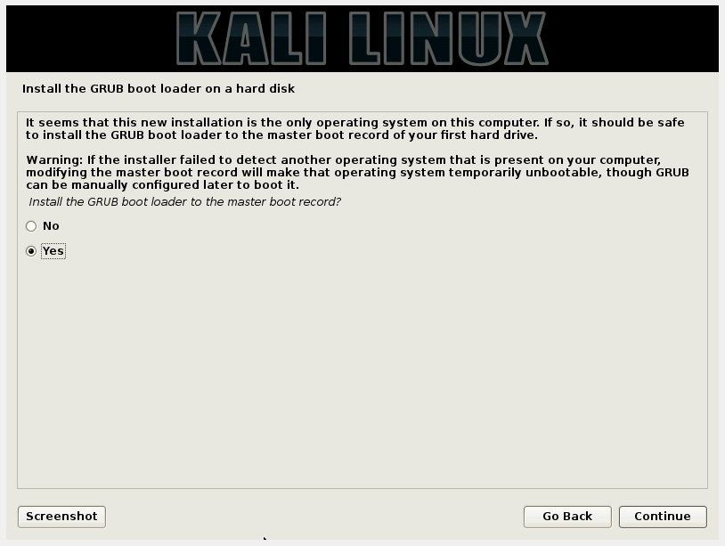

# PKSJ - Tugas 1

## Pendahuluan

**Anggota Kelompok**

| NRP         | Nama                     |
|-------------|--------------------------|
| 5113100050  | Freddy Hermawan Y        |
| 5113100109  | Daniel Fablius           |
| 5113100113  | Muhamad Luthfie La Roeha |

#### Penjelasan Tugas
**Uji penetrasi 1 :**
* Instal sebuah virtual OS dengan Ubuntu server
* Instal SSH server dengan konfigurasi default
* Instal satu lagi virtual OS dengan OS bebas, misalnya Kali Linux atau Ubuntu Desktop
* Pastikan tools untuk SSH brute force attack sudah terinstal
* Lakukan uji penetrasi 1: dengan THC-Hydra atau Ncrack dan catat hasil uji penetrasi 

**Uji penetrasi 2:**
* Instal fail2ban pada Ubuntu server yang telah diinstal SSH servernya
* Konfigurasilah SSH server agar tidak default lagi
* Lakukan uji penetrasi 2 dengan tools yang sama dan catat hasilnya

SSH(Secure Shell) adalah  sebuah protokol jaringan kriptografi untuk komunikasi data yang aman, login antarmuka baris perintah, perintah eksekusi jarak jauh, dan layanan jaringan lainnya antara dua jaringan komputer. Ini terkoneksi, melalui saluran aman atau melalui jaringan tidak aman, server dan klien menjalankan server SSH dan SSH program klien secara masing-masing.
Terdapat 2 versi SSH yaitu SSH 1 dan SSH 2. bedanya terletak pada mencakup kedua fitur keamanan dan peningkatan perbaikan tingkat keamanan yang disediakan.
Sebagai contoh, applikasi menggunakan ssh adalah openssh.(https://id.wikipedia.org/wiki/SSH)

Akan tetapi karena masih menggunakan password dan username yang digunakan sebagai otentikasi pada SSH sehingga menimbulkan serangan yang disebut dengan SSH brute force attack. Yang dimaksud dengan SSH brute force attack adalah kita menggirimkan password / passphrases dan username yang kita ketahui dengan harapan membuka komunikasi SSH yang ada (https://en.wikipedia.org/wiki/Brute-force_attack)

## Dasar Teori


**1. OS yang digunakan**

* **Kali Linux** adalah 
Kali Linux adalah salah satu distribusi Linux tingkat lanjut untuk Penetration Testing dan audit keamanan, pembangunan kembali BackTrack Linux secara sempurna,  mengikuti sepenuhnya kepada standar pengembangan Debian.(http://id.docs.kali.org/introduction-id/apa-itu-kali-linux)

* **Ubuntu Server** adalah 
Ubuntu server adalah suatu desain ubuntu yang digunakan untuk diinstall di lingkungan enterprise atau perusahaan untuk keperluan seperti web server ataupun router, secara default versi server ini tidak menyertakan antarmuka GUI, yang ada hanya shell alias Command line,aplikasi bawaan dari ubuntu server sekedar info buat anda berupa aplikasi serveri webserver, DNS server, DHCP server, firewall, openSSH, dan applikasi yang berhubungan dengan server, teknologi yang dibenamkan diserver juga umumnya hanya dipakai oleh orang yang benar benar advanced di Linux. (https://etix.wordpress.com/2010/01/28/perbedaan-ubuntu-server-dan-desktop/)

**2. Tools yang digunakan**

*Cracking Tool*

* **Hydra**, adalah paralelisasi cracker login yang mendukung banyak protokol untuk menyerang sasaran yang diinginkan. software ini sangat cepat dan fleksibel dan modulenya diinginkan dapat ditambah dengan mudah. Tools ini sangat memungkinkan untuk peneliti dan konsultan keamanan untuk mendapatkan unauthorized access kepada suatu remote sistem. (http://tools.kali.org/password-attacks/hydra)

* **BELUM SELESAI**, adalah

*Defending Tool*

* **Fail2Ban** adalah package keamanan yang digunakan untuk mencegah serangan brute-force dan DDoS pada linux. cara kerjanya sebagai berikut memonitor jumlah kegagalan login untuk selanjutnya memblok ip address dari login yang gagal tersebut.(https://kpunikomlipi.wordpress.com/2012/07/30/konfigurasi-fail2ban-untuk-mengamankan-server/)
 

## Persiapan

#### 1. Langkah Instalasi Kali Linux
 1.apabila kita menginstall melalui graphical install

 2. memilih bahasa yang akan kita gunakan dalam OS tersebut.

 3. memilih lokasi dimana kita sekarang


 4. memilih konfigurasi keyboard yang akan kita pakai

 5. mengetikkan nama host yang kita mau

 6. mengetikkan nama domain komputer yang kita inginkan

 7. mengetikkan password yang kita inginkan

 8. memilih time zone yang kita inginkan

 9. memilih cara partisi yang kita inginkan (untuk pemula disarankan yang guided- use entire disk)

 10. memilih disk yang akan dipartisi


 11. kalau sudah selesai maka kita akan memilih finish partitioning terus mengklik continue

 12. kalau menurut kita sudah benar maka tinggal klik yes terus continue


 13. kita akan dihadapi apakah kita akan mendownload mirror untuk kali linux atau tidak (kalau ada internet ya pilih ya terus kalau tidak ada internet pilih tidak)

 13b. kalau pada step 12 pilih ya maka kita akan disuruh memasukkan network proxy (kalau ada kita mengisikan network proxy kalau tidak ada jangan di tulis).

 14. memilih yes untuk memasang boot loader ke master boot record pada harddisk


 15. Selesai

#### 2. Langkah Instalasi Ubuntu Server
 1. memilih bahasa yang akan digunakan dalam proses installasi.

 2. memilih install ubuntu server

 3. memilih bahasa yang akan kita gunakan dalam OS tersebut

 4. memilih lokasi dimana kita sekarang


 5. memilih konfigurasi keyboard yang akan kita pakai


Proses yang terjadi diantara proses 5 dan 6

 6. mengetikkan nama host yang kita mau

 7. mengetikkan full name dan nama usernya kita yang kita mau


 8. mengetikkan password dan verify password yang kita inginkan


 9. memilih apakah mau home directorynya di encrypt atau tidak(kalau ingin lebih aman pada bagian ini pilih ya kalau tidak pilih bagian no)

 10. memilih time zone yang kita inginkan.

 11. memilih cara partisi yang kita inginkan (untuk pemula disarankan yang guided- use entire disk)

 12. memilih disk yang akan dipartisi

 13. kalau sudah selesai maka kita akan memilih finish partitioning terus mengklik yes

 14. pada step ini kita akan disuruh mendownload sebagian konfirmasi yang diinginkan maka jika ada network proxy tinggal isi kalau tidak ada dikosongkan

 15. memilih tipe upgrade yang akan dilakukan pada system, tinggal pilih sesuai dengan kebutuhan yang kita inginkan

 16. memilih softaware yang akan diinstall selain dari core system yang ada.(pilih sesuai dengan kebutuhan)

 17. memilih yes untuk memasang boot loader ke master boot record pada harddisk

 18. Selesai.


#### 3. Penambahan User

1. Tambahkan *user* baru dengan nama *user* `lutfi` dan password `dolphins` dengan cara :
```
sudo adduser lutfi
```
2. Setelah itu sistem akan meminta password untuk *user* `lutfi`. Masukkan password `dolphins`.

#### 4. Konfigurasi Server
> Server IP : 10.151.36.109
>
> username : server
> password : pksj123!
>
> username : lutfi
> password : dolphins

## Uji Penetrasi 1

#### 1. Uji Penetrasi dengan Hydra

Pada tahap ini, kami melakukan 2 skenario uji penetrasi, yaitu :
1. Brute Force User `lutfi` menggunakan list password [500-worst-password.txt](http://downloads.skullsecurity.org/passwords/500-worst-passwords.txt.bz2)
2. Brute Force User `server` menggunakan list password [500-worst-password.txt](http://downloads.skullsecurity.org/passwords/500-worst-passwords.txt.bz2)

**Skenario 1** : Brute Force user `lutfi` menggunakan list password [500-worst-password.txt](http://downloads.skullsecurity.org/passwords/500-worst-passwords.txt.bz2)
- Download file [500-worst-password.txt](http://downloads.skullsecurity.org/passwords/500-worst-passwords.txt.bz2) dengan cara :
```
wget http://downloads.skullsecurity.org/passwords/500-worst-passwords.txt.bz2
```
- Extract file tersebut dengan cara :
```
bzip2 -d 500-worst-passwords.txt.bz2
```
- Lalu, gunakan *Hydra* untuk melakukan Brute Force Attack pada user `lutfi` dengan cara :
```
hydra -l lutfi -P 500-worst-passwords.txt 10.151.36.109 ssh
```
 Pastikan pada direktori yang aktif terdapat file **500-worst-passwords.txt**
- Tools `Hydra` akan melakukan Brute Force Attack dengan menggunakan username `lutfi` dan list password yang ada pada [500-worst-password.txt](http://downloads.skullsecurity.org/passwords/500-worst-passwords.txt.bz2) pada alamat IP `10.151.36.109`
- Tunggu hingga proses Brute Force selesai dilakukan. Seperti dibawah ini :


**Skenario 2** : Brute Force User `server` menggunakan list password [500-worst-password.txt](http://downloads.skullsecurity.org/passwords/500-worst-passwords.txt.bz2)
- Lalu, gunakan *Hydra* untuk melakukan Brute Force Attack pada user `lutfi` dengan cara :
```
hydra -l lutfi -P 500-worst-passwords.txt 10.151.36.109 ssh
```
 Pastikan pada direktori yang aktif terdapat file **500-worst-passwords.txt**
- Tools `Hydra` akan melakukan Brute Force Attack dengan menggunakan username `server` dan list password yang ada pada [500-worst-password.txt](http://downloads.skullsecurity.org/passwords/500-worst-passwords.txt.bz2) pada alamat IP `10.151.36.109`
- Tunggu hingga proses Brute Force selesai dilakukan.
- Karena password yang dipakai tidak ada pada list password, maka akan tampil seperti dibawah ini :


## Uji Penetrasi 2
Dalam Uji Penetrasi 2, Ubuntu Server akan terinstalasi tools Fail2ban.
dan Konfigurasi pada ubuntu server akan diubah dari default konfigurasinya.
#### 1. Uji Penetrasi dengan Hydra

Pada tahap ini, kami melakukan 2 skenario uji penetrasi, yaitu :
1. Brute Force User `server` menggunakan list password [500-worst-password.txt](http://downloads.skullsecurity.org/passwords/500-worst-passwords.txt.bz2), dengan konfigurasi pada ssh-server
2. Brute Force User `server` menggunakan list password [500-worst-password.txt](http://downloads.skullsecurity.org/passwords/500-worst-passwords.txt.bz2), dengan konfigurasi Fail2Ban.


**Skenario 1** : Brute Force user `server` menggunakan list password [500-worst-password.txt](http://downloads.skullsecurity.org/passwords/500-worst-passwords.txt.bz2), dengan konfigurasi pada ssh-server

Pada UBUNTU SERVER:
- konfigurasi ssh-server melalui file sshd_config, lalu menambahkan 
```
PasswordAuthentication no
```
pada file sshd_config, seperti berikut


- lalu restart service ssh dengan command:
```
sudo service ssh restart
```

Pada KALI LINUX : 
- Download file [500-worst-password.txt](http://downloads.skullsecurity.org/passwords/500-worst-passwords.txt.bz2) dengan cara :
```
wget http://downloads.skullsecurity.org/passwords/500-worst-passwords.txt.bz2
```
- Extract file tersebut dengan cara :
```
bzip2 -d 500-worst-passwords.txt.bz2
```
- Lalu, gunakan *Hydra* untuk melakukan Brute Force Attack pada user `lutfi` dengan cara :
```
hydra -l server -P 500-worst-passwords.txt 10.151.36.109 ssh
```
 Pastikan pada direktori yang aktif terdapat file **500-worst-passwords.txt**
- Tools `Hydra` akan melakukan Brute Force Attack dengan menggunakan username `lutfi` dan list password yang ada pada [500-worst-password.txt](http://downloads.skullsecurity.org/passwords/500-worst-passwords.txt.bz2) pada alamat IP `10.151.36.109`
- Tunggu hingga proses Brute Force selesai dilakukan. Seperti dibawah ini :


**Skenario 2** : Brute Force User `server` menggunakan list password [500-worst-password.txt](http://downloads.skullsecurity.org/passwords/500-worst-passwords.txt.bz2), dengan konfigurasi pada tools fail2ban

PADA UBUNTU SERVER
- Lakukan instalasi fail2ban dengan mengetikkan command:
```
sudo apt-get install fail2ban
```
- lalu konfigurasi fail2ban agar melakukan "ban" pada user yang mencoba login, jika telah mencoba 3 kali pada rentang waktu 60 detik, dengan cara menambahkan command:
```
findtime = 60
maxretry = 3
```
pada file konfigurasi fail2ban (/etc/fail2ban/jail.conf), seperti berikut


PADA KALI LINUX
- Masukkan password user yang akan di bruteforce pada file **500-worst-passwords.txt** pada urutan terakhir dari list password yang akan dicoba.

- Lalu, gunakan *Hydra* untuk melakukan Brute Force Attack pada user `server` dengan cara :
```
hydra -l server -P 500-worst-passwords.txt 10.151.36.109 ssh
```
 Pastikan pada direktori yang aktif terdapat file **500-worst-passwords.txt**
- Tools `Hydra` akan melakukan Brute Force Attack dengan menggunakan username `server` dan list password yang ada pada [500-worst-password.txt](http://downloads.skullsecurity.org/passwords/500-worst-passwords.txt.bz2) pada alamat IP `10.151.36.109`
- Tunggu hingga proses Brute Force selesai dilakukan.
- Karena percobaan login telah melebihi 3 kali dalam 1menit maka user yang mencoba login akan di ban sekalam 600 detik (sesuai pada konfigurasi fail2ban.


## Kesimpulan dan Saran
- untuk mencegah ssh brute force dapat dilakukan beberapa hal, beberapa diantaranya adalah dengan melakukan konfigurasi pada ssh-server atau menggunakan tools untuk mencegah ssh brute-force attack seperti fail2ban.

- dari kedua cara yang telah di lakukan, pencegahan ssh brute force attack lebih baik menggunakan tools, dikarenakan lebih bervariasinya fitur pencegahan serangan yang dapat digunakan.